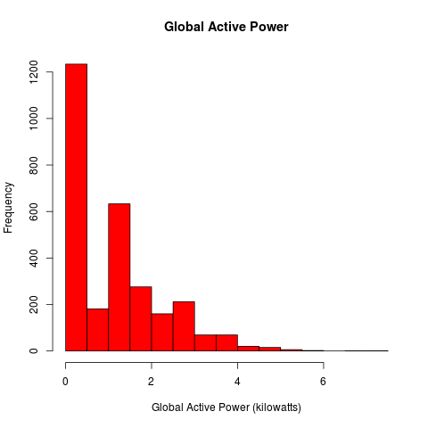
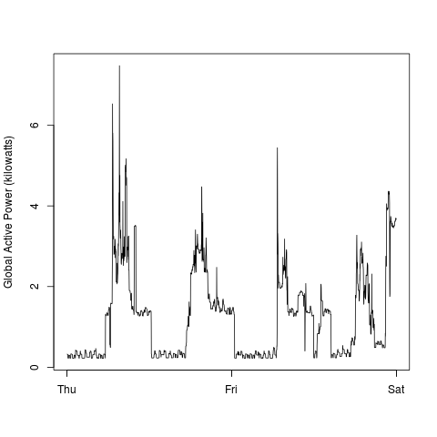
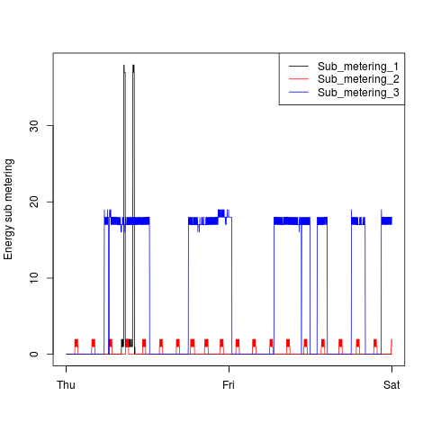
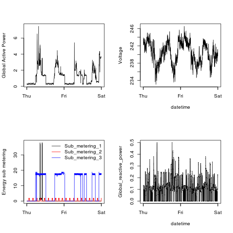

## Exploratory Data Analysis Assignment 1

Note that a separate get_data.R script has been included for automatically downloading the zip file. The actual data files have been excluded to save space.

### Plot 1

 

### Plot 2

 

### Plot 3

 

### Plot 4

 

